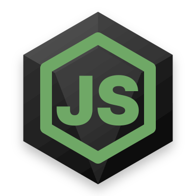
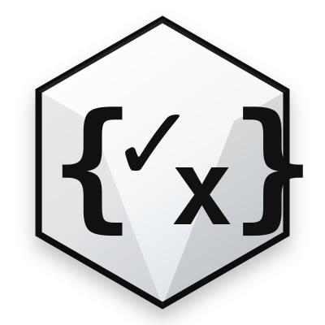
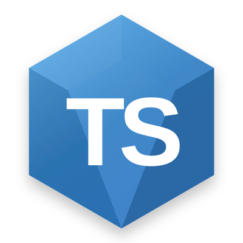
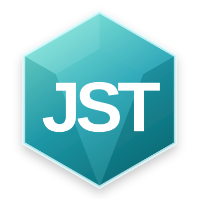

<p align="center">
  
  
  
  
  
  
  
</p>

# json-tology

> One source of truth for TypeScript types, runtime validation, coercion, and OWL ontology output. Author in JSON Schema; share with any backend; reason over the graph.

## Documentation

The full documentation is published at **https://studnicky.github.io/json-tology/**.

- [Getting Started](https://studnicky.github.io/json-tology/getting-started)
- [Picking a method](https://studnicky.github.io/json-tology/picking-a-method)
- [Argument conventions](https://studnicky.github.io/json-tology/argument-conventions)
- [Bookstore domain](https://studnicky.github.io/json-tology/bookstore-domain) - the running example used throughout the docs
- [Validation](https://studnicky.github.io/json-tology/validation/instantiate), [Composition](https://studnicky.github.io/json-tology/composition/extend), [Serialization](https://studnicky.github.io/json-tology/serialization/dump)
- [Ontology and Graphs](https://studnicky.github.io/json-tology/advanced/ontology) - OWL TBox, SHACL, JSON-LD, ABox projection
- [Usage Examples](https://studnicky.github.io/json-tology/usage-examples/transforms-recipes) - transforms cookbook, custom format validators

## Install

```bash
npm install json-tology
```

## License

MIT - see [LICENSE](./LICENSE).

## Changelog

See [CHANGELOG.md](./CHANGELOG.md) and the [GitHub releases](https://github.com/Studnicky/json-tology/releases).
